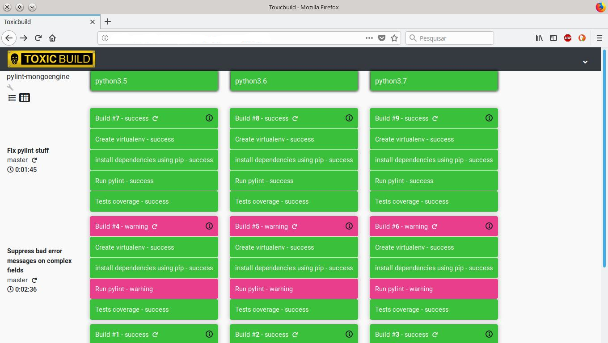

Configuring builds
==================

When a change in the source code is detected a group of `builds`, called
`buildset`, is created. Which builds are created in a buildset is controlled
by a configuration file called ``toxicbuild.yml`` in the root directory of
your project.

.. note::

   If you want that a specific buildset does't create any builds,
   in the build of your commit message put ``ci: skip``

.. _build-simple-config:

Simple configuration
++++++++++++++++++++

The easiest way to configure a build is to use a language config. So lets
say we have a python project that executes the ``pytest`` step. The
simple configuration is:

.. code-block:: yaml

   language: python

   steps:
     - pytest

As it is a python build, before the steps you've configured two other steps
will be executed: create a virtual env and install the dependencies in
a requirements file called ``requirements.txt``. To change the file name
use the ``requirements_file`` parameter.

.. code-block:: yaml

   language: python
   requirements_file: other_requirements.txt

   steps:
     - pytest

.. note::

   The language configuration depends on language plugins. See
   :ref:`language-plugins`

If we inform the ``language`` as ``generic`` we will get a minimum host system
and then we install what is needed using the ``system_packages`` parameter.

.. code-block:: yaml

   language: generic
   system_packages:
     - gcc
     - make

   steps:
     - make
     - make test

.. note::

   The installation of system packages depends on system plugins. See
   :ref:`system-plugins`

An example
----------

The following configuration

.. code-block:: yaml

   language: python
   versions:
     - '3.5'
     - '3.6'
     - '3.7'

   steps:
     - name: Run pylint
       command: pylint pylint_mongoengine
       warning_on_fail: true

     - name: Tests coverage
       command: sh ./build-scripts/check_coverage.sh pylint_mongoengine 100

Generates the following buildset

|waterfall-py-example-img|

.. _build-advanced-config:

Advanced configuration
++++++++++++++++++++++

`Builds` are simply a sequence of shell commands, called `steps`,
that are executed sequentially. These builds are carried by `builders`.
The build configuration is based on these steps and builders.

So, let's say you have build process consisting in two steps: ``make`` and
``make test``. To have these executed a builder with these two steps:

.. code-block:: yaml

    # You must have a list of builders
    builders:
      # Our builder will be called `MyBuilder`
      - name: MyBuilder
	# and will execute two steps
	steps:
	  - make
	  - make test

Build environment variables
---------------------------

You can set environment variables in a build using the ``envvars``
parameter of a builder:

.. code-block:: yaml

    builders:
      - name: MyBuilder
	steps:
	  - make
	  - make test

	# key: value pairs
	envvars:
	  SOME_VAR: the-value

Build branches
--------------

You can use the ``branches`` parameter to limit the branches for
a builder:

.. code-block:: yaml

    builders:
      - name: MyBuilder
	steps:
	  - make
	  - make test

        # A list of branches' names. You can use wildcards.
	branches:
	  - master
	  - bug-*

Build plugins
-------------

The ``plugins`` parameter is a list of plugins configurations:

.. code-block:: yaml

    builders:
      - name: MyBuilder
	steps:
	  - make
	  - make test

	plugins:
	  - name: apt-install
	    packages:
	      - rabbitmq-server

See :ref:`builder-plugins-config` for information about plugins.

Conditional builds
------------------

One builder can configured to be triggered by another builder using the
``triggered_by`` parameter:

.. code-block:: yaml

    builders:
      - name: MyBuilder
	...

      - name: OtherBuilder
	...

	triggered_by:
	  # This builder - OtherBuilder - will be triggered only if
	  # MyBuilder finishes its build with status success
	  - builder_name: MyBuilder
	    statuses:
	      - success

You can have a list of statuses and then if the builder finishes with
anyone of this statuses the build will be triggered.

If you have a list of builders conditions these are AND clauses.

Step parameters
---------------

Steps can be more then simple commands, you have some parameters for step:

.. code-block:: yaml

   builders:
     - name: MyBuilder
       steps:
       # You can give a descriptive name for the step
       - command: make
	 name: Build the project

       # We can also give a timeout for the step. The timeout counts for how
       # long a step keeps running without sending any data to the output.
       - command: make test
	 name: Test the whole stuff
	 timeout: 300  # seconds without output

The following are the options accepted by the step:

* ``stop_on_fail``: If true, the build will halt if the step fails.
* ``warning_on_fail``: If true the build status will be marked as warning if
  the command fails (exits with a status different than 0).
* ``timeout``: How many seconds we should wait for the step complete. The
  default is 3600 seconds (one hour).

.. _builder-plugins-config:

Build Plugins
+++++++++++++

Plugins may add steps before and/or after your own steps. At the moment we have
only two plugins. They are:

.. _language-plugins:

Language plugins
----------------

Python virtualenv plugin
~~~~~~~~~~~~~~~~~~~~~~~~

A very common way of installing python packages is installing it
inside a `vitualenv` using ``pip``.
This plugin enables you test your python programs inside a `virutalenv` and
install the python dependencies using ``pip``.

The basic configuration of this plugin is as follows:

.. code-block:: yaml

   PY_ENV_PLUGIN:  &PY_ENV_PLUGIN
     name: python-venv
     pyversion: python3.5

   # your builder config
   builders:
     - name: My Builder
       ...
       plugins:
         - <<: *PY_ENV_PLUGIN

      ...

This will include two steps before your steps: First will create a virtualenv
using python3.5 and then will install the dependencies using pip.

.. note::

   This plugin uses the external program ``pip``.
   You must have it installed in the slave system.

Python virtualenv parameters
^^^^^^^^^^^^^^^^^^^^^^^^^^^^

The following params may be used with this plugin:

* ``requirements_file``: File that contains a list of dependencies to install
  with pip. The default is `requirements.txt`.
* ``remove_env``: Indicates if the virtualenv will be removed after are
  executed. Default is False.

.. _system-plugins:

System plugins
--------------

APT install plugin
~~~~~~~~~~~~~~~~~~

This plugins installs a list of packages in a Debian system using the apt-get
command.

.. code-block:: yaml

   APT_INSTALL_PLUGIN:  &APT_INSTALL_PLUGIN
     name: apt-install
     packages:
       - build-essential
       - python3.6-dev

.. note::

   This plugin use the external program ``sudo``. You must have this
   installed in the slave system.

.. note::

   This is a plugin that uses the APT package system, thus can only be used in
   Debian (or Debian-based) systems.
