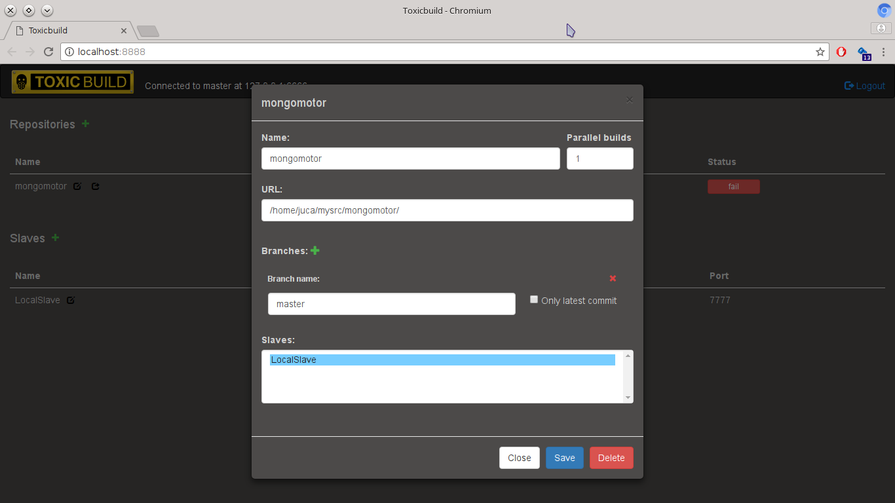

.. toxicbuild documentation master file, created by
   sphinx-quickstart on Thu May 15 21:22:59 2014.
   You can adapt this file completely to your liking, but it should at least
   contain the root `toctree` directive.

ToxicBuild |toxicbuild-logo|
============================

.. |toxicbuild-logo| image:: ./_static/Logo.svg
    :alt: Simple and flexible continuous itegration tool.

ToxicBuild is a simple but flexible distributed continuous integration tool
that enables you to configure your ci process using the power of the Python
programming language.

Install
+++++++

ToxicBuild is written in Python, and runs in Python3.4 and later. It uses
mongodb to store data and git as vcs. You must have these installed.

.. note::

   These are the external programs used by ToxicBuild, but to install the
   code dependencies you may need a C compiler and the header files for your
   Python interpreter and for libffi. In a Debian system install the packages
   ``build-essential``, ``libffi-dev`` and ``pythonX.Y-dev``, where X.Y is the
   version of your interpreter.

After the installation of the external dependencies you can install toxicbuild
using pip:

.. code-block:: sh

   $ pip install toxicbuild

And that's it. ToxicBuild is installed.

Usage
+++++

First you need to create a new environment for your continuous integration.
This is done using the command ``toxicbuild create``.

.. code-block:: sh

    $ toxicbuild create ~/ci
    Creating root_dir ~/ci/slave for toxicslave
    Toxicslave environment created with access token: ...
    Creating root_dir ~/ci/master for toxicmaster
    Toxicmaster environment created with access token: ...
    Creating root_dir ~/ci/ui
    Username for web access:
    Password for web access:
    Toxicui environment created for web

.. note::

   This install process assumes you have the mongo instance running in
   localhost and listen the default port. If needed, change these configs
   in the file `~/ci/master/toxicmaster.conf`.

After the environment is created, use the command ``toxicbuld start`` to
start everything needed.

.. code-block:: sh

    $ toxicbuild start ~/ci
    Starting toxicslave
    Starting toxicmaster
    Starting tornado server on port 8888

And now access http://localhost:8888 in your browser. Use the username and
password supplied in the create process to access the web interface.

Now that you are in the web interface, the first thing you need to do is
to add a new repository to ToxicBuild.

|add-repo-img|

.. note::

   The `branches` field is not required. It indicates which branches ToxicBuild
   should look for changes. If no branch is inserted here ToxicBuild will look
   for changes in all remote branches. This may be expensive depending on the
   number of branches you have.

   If `Only latest commit`, when a bunch of commits are retrieved in the same
   fetch, only the most recent one will be builded.

.. note::

   You need to choose at least one slave or no builds will be executed.

After you project is cloned you should see the status of your project
as `ready`. The only thing missing now is to configure the build in
your project.

Configuring a build
+++++++++++++++++++

`Builds` are simply a sequence of shell commands, called `steps` in
ToxicBuild, that are executed sequencially. The builds are done by
`builders`. The build config is based in these steps and builders.
Everytime a change is detected in the source code new `builds` will be
created for the `builders` that will execute the `steps`.

So, let's say you have build process consisting in two steps: ``make`` and
``make test``. To have this executed by ToxicBuild we create a builder
with these two steps. This config must be in a file called `toxicbuild.conf`
in the root dir of your code:

.. note::

   The `toxicbuild.conf` file is a Python file, do whatever you want, but
   you must have a ``BUILDERS`` list.

.. code-block:: python

    # The step configuration has two required keys: 'name' and 'command'
    MAKE_STEP = {'name': 'Compile', 'command': 'make'}
    MAKE_TEST_STEP = {'name': 'Test': 'command': 'make test'}

    # Builder configuration has two requred keys: 'name' and 'steps'.
    # The 'steps' value is a list of steps configs.
    BUILDER = {'name': 'my-builder',
		'steps': [MAKE_STEP, MAKE_TEST_STEP]}

    # And now we need to add the builder config to a list of builders
    # that will be used in the builds. You may have more than one builder
    # and the builders will execute the builds in parallel for every change
    # in the source code.
    BUILDERS = [BUILDER]

And it is done! Commit and push this config to you repository and ToxicBuild
will execute this steps everytime a change is detected in your source code.

Step params
-----------

The two params we saw, ``name`` and ``command``, are the two required params
for a steps, but the following params may be used too:

* ``stop_on_fail``: If true, the build will halt if this step fails.
* ``warning_on_fail``: If true the build status will be marked as warning if
  the command fails (exits with a status different than 0).
* ``timeout``: How many seconds we should wait for the step complete. The
  default is 3600 seconds (one hour).

Builder params
--------------

Builder has extra optional params, too. They are the following:

* ``branch``: Indicates which branch triggers this builder. If no branch, all
  branches will trigger the builder.
* ``envvars``: A dictionary in the form {VAR: VALUE} for environment variables
  to be used in all steps in this builder.
* ``plugins``: A list of plugins that will be used in the builder.

Plugins
-------

Plugins may add steps before and/or after your own steps. At the moment we have
only two plugins. They are

Python virtualenv plugin
^^^^^^^^^^^^^^^^^^^^^^^^

A very common way of installing python packages is using a `vitualenv`.
This plugin enables you test your python programs inside a virutalenv.

The basic configuration of this plugin is as follows:

.. code-block:: python

    PY_VENV = {'python-venv', 'pyversion': 'python3.5'}

This will include two steps before your steps: First will create a virtualenv
using python3.5 and then will install the dependencies using pip.

.. note::

   This plugin uses the external program ``virtualenv``. You must have this
   installed in the slave system.

Python virtualenv params
~~~~~~~~~~~~~~~~~~~~~~~~

The following params may be used with this plugin:

* ``requirements_file``: File that contais a list of dependencies to install
  with pip. The default is `requirements.txt`.
* ``remove_env``: Indicates if the virtualenv will be removed after are
  executed. Default is False.

Aptitude install plugin
^^^^^^^^^^^^^^^^^^^^^^^

This plugins installs a list of packages in a debian system using the aptitude
command.

.. code-block:: python

   APT_INSTALL = {'name': 'aptitude-install', 'packages': ['build-essential']}

.. note::

   This plugin uses the external programs ``sudo`` and ``aptitude``. You must
   have these installed in the slave system.

Source Code
===========

The source code is hosted on github.

Licence
=======

ToxicBuild is free software released under the GPLv3 or later.

Hacking
========

See :doc:`Hacking ToxicBuild <hacking>`.

Known Bugs
==========

- The waterfall.js does not now how to include new builders that came via
  websocket and sometimes it places the build in a wired place. Must reload
  the page.

- Slaves should kill all processes created by its child processes.

Aditional notes
===============

- Slaves must to work in all platforms. Probably now they will not work, some
  development towards this feature must be done. Master and ui would be nice to
  work in as many platforms as possible.

- ToxicBuild should have a build step that triggers another builder.

- Should support more vcs, not only git.

- It needs other report methods other than the web ui.

- Needs an install for master, slave and ui separately.

- Should support ssl.

Changelog
=========

* 0.3.1

  - Corrected bug with new branches. Now it fetches the remote branches every
    time it looks for incomming changes

* 0.3

  - Re-wrote from scratch. It does not uses BuildBot as base anymore. Now it is
    written using python 3 and asyncio.

* 0.2.1

  - Corrected gitpoller branches behavior
  - added js to reload the waterfall web status
  - Correction on poller to poll() asap in order to have some builders.

* 0.2

  - Initial release

That's all. Thank you very much for using ToxicBuild!
