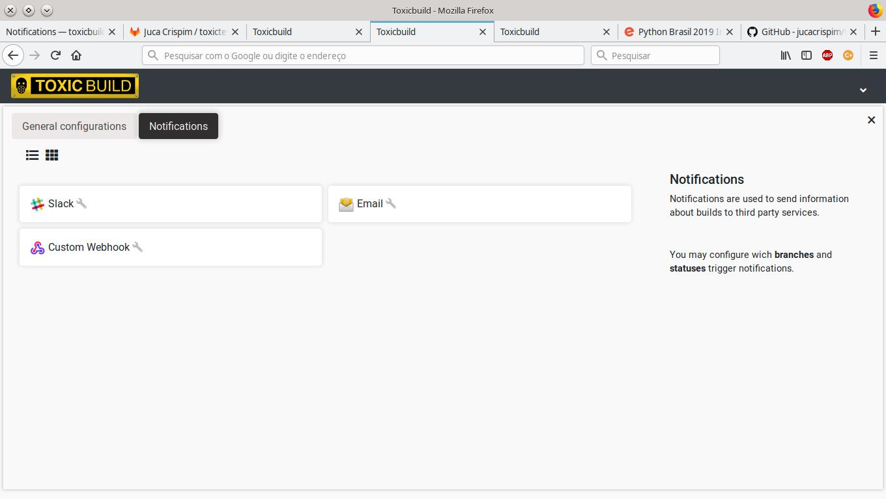
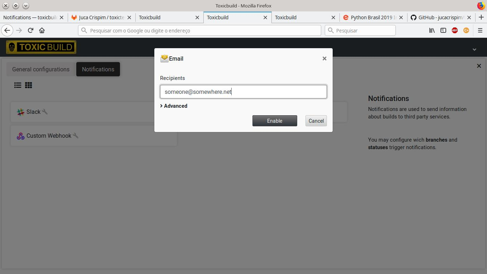
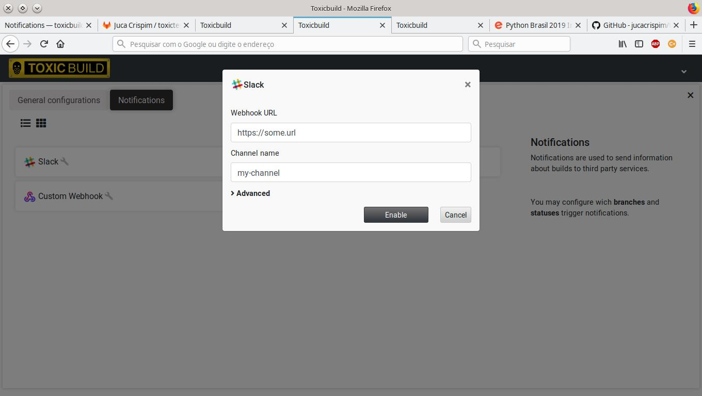
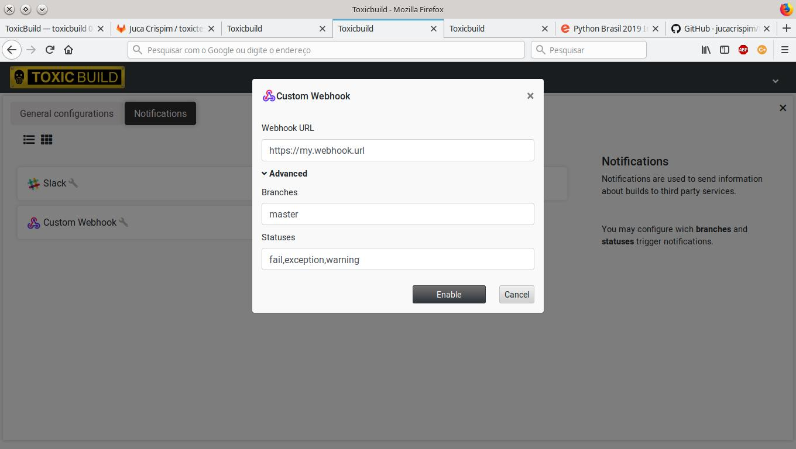

Notifications
=============

.. _notifications:

Notifications are the way ToxicBuild sends messages about builds to third
party services.

|notification-methods-img|

All the notification methods have the following common configuration
options:

* ``Branches``: Which branches may trigger the notification method. This is
  a list. The values are coma-separated.
* ``Statuses``: Which statuses may trigger the notification method. This is
  a list. The values are coma-separated.

Email notification
++++++++++++++++++

Sends notifications using email.

.. note::

   To use this notification method you must configure the SMTP parameters
   in toxicoutput. See :ref:`toxicoutput-config`

This method have the following parameters:

|email-notification-img|

* ``Recipients``: Email addresses that will receive messages. This is a list.
  The values are coma-separated.

Slack notification
++++++++++++++++++

Sends notifications to a slack channel.

This method have the following parameters:

|slack-notification-img|

* ``Webhook URL``: The URL for the slack webhook.
* ``Channel name``: The name of the slack channel.

Custom webhook notification
+++++++++++++++++++++++++++

Sends notifications to a custom webhook.

This method have the following parameters:

|custom-webhook-notification-img|

* ``Webhook URL``: The URL for the webhook. This method sends a post request
  the the webhook URL. The body of the request is a json with 3 keys:
  ``repository``, ``build`` and ``buildset``.
