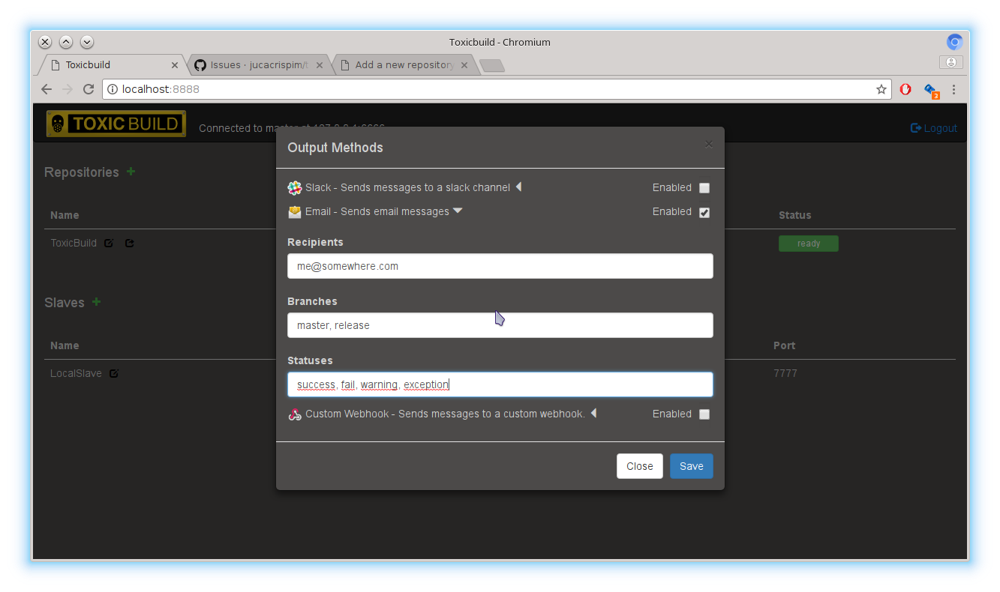

Add a new repository
====================

The first thing we need is to add a repository we want to have a continuous
integration process. This is done by clicking in the `Add repository` button.

|add-repo-img|

.. |add-repo-img| image:: ./_static/add-repo.png
    :alt: Adding new repository

Repository Params
+++++++++++++++++

- ``Name (required)``: A name for the repository.
- ``Parallel builds``: Limits the number of parallel builds for this
  repository. If null or 0 there is no limit for builds.
- ``URL (required)``: The url for the repository.
- ``Branches``: It indicates which branches ToxicBuild should look for changes.
  If no branch is inserted here ToxicBuild will look for changes in all remote
  branches.

  .. note::

     If `Only latest commit`, when a bunch of commits are retrieved in the same
     fetch, only the most recent one will be builded.

- ``Slaves``: The slaves that will execute builds for this repository. You must
  to choose at least one slave or no build will be executed.

Notifications
+++++++++++++

Notifications are the way ToxicBuild sends messages about builds using a given
notification method. All notification methods have the following common
parameters:

|notification-methods-img|

- ``Branches``: Which branches may trigger the notification method. This is
  a list. The values are coma-separated.
- ``Statuses``: Which statuses may trigger the notification method. This is
  a list. The values are coma-separated.

Email notification
------------------

Sends notifications using email. This method have the following parameters:

.. note::

   To use this notification method you must configure the smtp parameters
   in toxicmaster.

- ``Recipients``: Email addresses that will receive messages. This is a list.
  The values are coma-separated.

Slack notification
-------------------

Sends notifications to a slack channel. This method have the following
parameters:

- ``Webhook URL``: The url for the slack webhook.
- ``Channel name``: The name of the slack channel.

Custom webhook notification
---------------------------

Sends notifications to a custom webhook. This method have the following
parameters:

- ``Webhook URL``: The url for the webhook. This method sends a post request
  the the webhook url. The body of the request is a json with 3 keys:
  ``repository``, ``build`` and ``buildset``.

Now we have a repository in ToxicBuild, we need to configure a build and this
is done creating a configfile called `toxicbuild.conf` in the root directory
of your repository.
