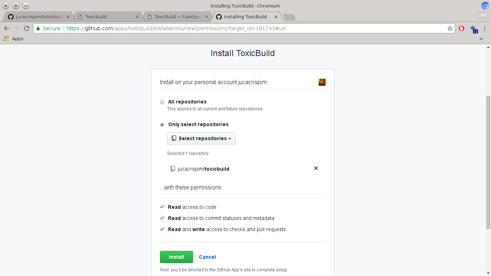
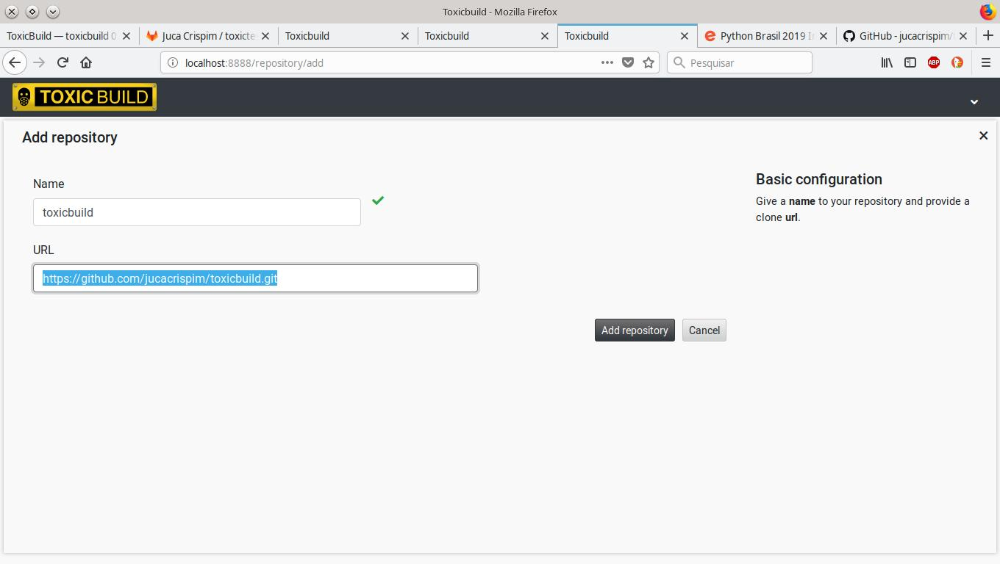

Importing Repositories
======================

You need to import the repositoires into ToxicBuild in order to be able to
have a continuous integrations. Repositories can be imported from github or
can be added manually.

Importing repositories from Github
++++++++++++++++++++++++++++++++++

After you have the github integration properly configured, simply click in the
github logo in the main page of the web interface:

|import-from-github-link-img|

.. |import-from-github-link-img| image:: ./_static/import-from-github.jpg
    :alt: Adding new repository

You will be redirected to Github and can choose wich repositories you want
imported into ToxicBuild.

|github-app-install|

After you select your repositoires and install, you will be redirect to
the ToxicBuild web ui again and that's it. Your repositories will be imported.

Now you can :ref:`configure configure your build <build-config>` and then
follow the builds' progress in the :ref:`waterfall <waterfall>` or using some
:ref:`notification method <notifications>`.

Importing repositories manually
++++++++++++++++++++++++++++++++

If you do not use github or do not want import your repositoires automaticaly,
you can import them by hand. Click in the `Add Repository` icon.

|import-manually|

In the add repository modal you will see the options for repository. The
options are explained above:

|add-repo-img|

.. |add-repo-img| image:: ./_static/add-repo.png
    :alt: Adding new repository

Repository Options
------------------

- ``Name (required)``: A name for the repository.
- ``Parallel builds``: Limits the number of parallel builds for this
  repository. If null or 0 there is no limit for builds.
- ``URL (required)``: The url for the repository.
- ``Branches``: It indicates which branches ToxicBuild should look for changes.
  If no branch is inserted here ToxicBuild will look for changes in all remote
  branches.

  .. note::

     If `Only latest commit`, when a bunch of commits are retrieved in the same
     fetch, only the most recent one will be builded.

- ``Slaves``: The slaves that will execute builds for this repository. You must
  to choose at least one slave or no build will be executed.

Now you can :ref:`configure configure your build <build-config>` and then
follow the builds' progress in the :ref:`waterfall <waterfall>` or using some
:ref:`notification method <notifications>`.
