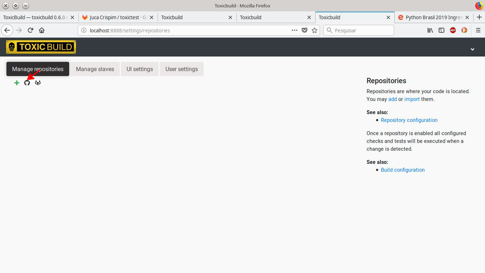
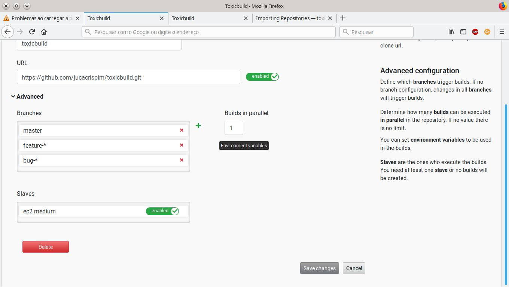

Importing Repositories
======================

You need to import the repositories into ToxicBuild to be able to
have continuous integration. Repositories can be imported from GitHub,
from gitlab or can be added manually.

Importing repositories from GitHub
++++++++++++++++++++++++++++++++++

First configure the :ref:`github-integration-config` then go to
`http://localhost:8888/settings/repositories` and click in the
GitHub link:

|import-from-github-link-img|

You will be redirected to Github and can choose which repositories you want
imported into ToxicBuild.

|github-app-install|

.. |github-app-install| image:: ./_static/github-app-install.jpg

After you select your repositories and install, you will be redirect to
the ToxicBuild web ui again and that's it. Your repositories will be imported.

Importing repositories from Gitlab
++++++++++++++++++++++++++++++++++

First configure the :ref:`gitlab-integration-config` then go to
`http://localhost:8888/settings/repositories` and click in the
gitlab link:

|import-from-gitlab-link-img|

The Gitlab integratio does not have an option to select the repositories
you want imported, so all your repositories will be imported, but you can
enable/disable repositories at `http://localhost:8888/settings/repositories`

|disable-gl-repo-link-img|

Importing repositories from Bitbucket
+++++++++++++++++++++++++++++++++++++

First configure the :ref:`bitbucket-integration-config` then go to
`http://localhost:8888/settings/repositories` and click in the
bitbucket link:

|import-from-bitbucket-link-img|

Bitbucket does not have an option to select the repositories you want
imported, so all your repositories will be imported, but you can
enable/disable repositories at `http://localhost:8888/settings/repositories`

|disable-bt-repo-link-img|

Adding repositories manually
++++++++++++++++++++++++++++

If you do not use github, gitlab or do not want import your repositories
automatically, you can add them by hand. Go to
`http://localhost:8888/repository/add`:

|import-manually|

.. |import-manually| image:: ./_static/import-manually.jpg

* ``Name`` - An unique name for the repository
* ``URL`` - The clone URL of the repository

Repository advanced configuration
+++++++++++++++++++++++++++++++++

When you click in the advanced link in the repository settings page
these are the available options:

|repo-advanced-config-img|

* ``Branches`` - Configure which branches trigger can builds. If no
  branches configuration, all branches will trigger builds. The branches
  configuration has the following options:

  |repo-branch-config-img|

  .. |repo-branch-config-img| image:: ./_static/repo-branch-config.jpg
					:alt: Repository branch configuration

  - ``Name`` - The branch name. You can use wildcards here.
  - ``Only most recent changes`` - If checked when a bunch of commits
    are pushed at the same time only the most recent will trigger builds

* ``Parallel builds`` - How many parallel builds this repository can
  run. If no parallel builds there is no limit.

* ``Environment variables`` - Environment variables that will be present
  in the build environment.

  |repo-envvars-config-img|

  .. |repo-envvars-config-img| image:: ./_static/repo-envvars-config.jpg
				       :alt: Repository envvars configuration

  - ``Key`` - The environment variable name
  - ``Value`` - The value of the variable

* ``Slaves`` - Which slaves can execute builds for the repository. If a
  repository don't have any enabled slave no builds will be executed.
