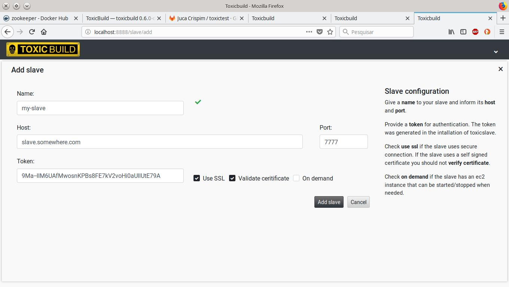

Adding Slaves
=============

Builds are executed by slaves so you need at least one slave or no builds
will be executed.

.. _add-slave:

Traditional slaves
++++++++++++++++++

A "traditional" slave is a slave that is running in a machine that is always
running, so you simply need to poit to that machine.

To do so, in the web interface go to
`http://localhost:8888/slave/add`:

|add-slave-img|

- ``Name`` - An unique name for the slave
- ``Host`` - The host of the slave. Not required for ec2 on-demand instances.
  See :ref:`add-ec2-slave`
- ``Port`` - The port used to connect to the slave
- ``Token`` - Authentication token created during the toxicslave installation
- ``Use SSL`` - Does the slave use a secure connection?
- ``Validate certificate`` - Should the slave certificate be validated?
- ``On demand`` - See :ref:`add-ec2-slave`

.. _add-ec2-slave:

On demand slaves
++++++++++++++++

To save on build costs you can use an on demnad slave, that is, the host where
the slave is installed is started when needed and stopped when all builds
are done. Currently this is only supported with amazon ec2 instances.

First check :ref:`ec2-integration` and then add a new slave at
`http://localhost:8888/slave/add`:

|add-on-demand-slave-img|

- ``Name`` - An unique name for the slave
- ``Host`` - Leave it blank as on demand instances have a new ip
  on start.
- ``Port`` - The port used to connect to the slave
- ``Token`` - Authentication token created during the toxicslave installation
- ``Use SSL`` - Does the slave use a secure connection?
- ``Validate certificate`` - Should the slave certificate be validated?
- ``On demand`` - Must be checked.
- ``Instance Id`` - The id of your ec2 instance.
- ``Region`` - The region where your ec2 instance is located.
