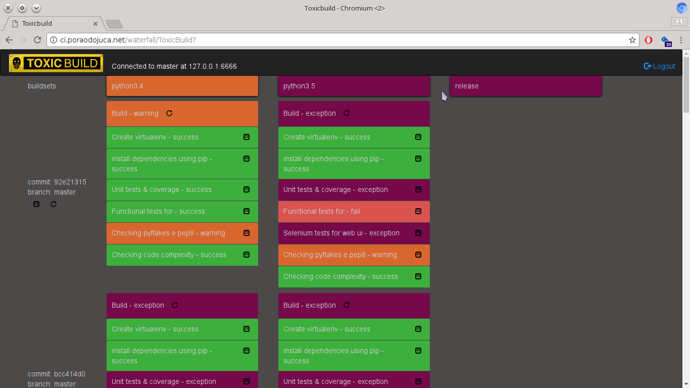

The waterfall
=============

The waterfall is where you can follow the progress of your builds. You can
access it clicking in the `status` button.

|waterfall-img|

In the first column you see the `buildsets`. They are collections of builds
that are based in a `revision`. A `revision` is a point in the source code,
a `commit` in a `branch`. You can see the buildset details clicking in the
`Buildset details` button and re-schedule all the builds for the buildset
clicking in the `Re-schedule buildset` button.

The other columns are columns for `builders` and its `builds`. Each row
has `builds` for the same `buildset`. You can s the `build` and `step` details
clicking in the `Build details` button and in the `Step details` button
respectively and re-schedule and specific build clicking in the
`Re-schedule build` button.
