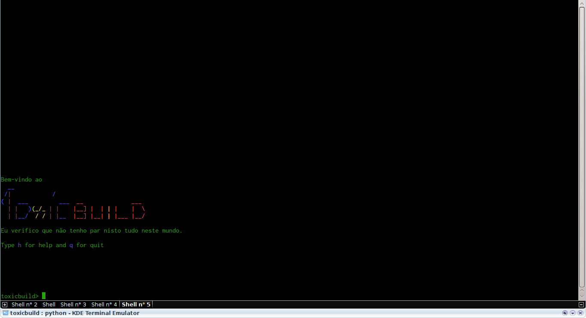
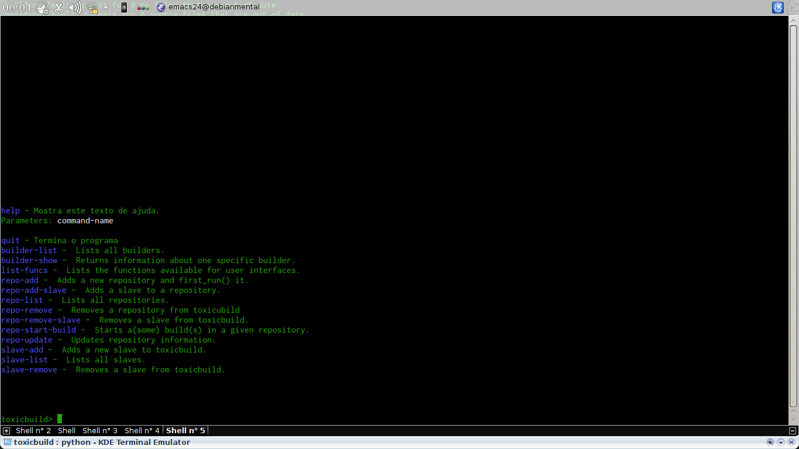

Bem-vindo à documentação do Toxicbuild!
=======================================

Toxicbuid é um sistema distribuído para automatização do processo de *build*,
*test* e *release* de software. Ele é fortemente inspirado no *buildbot*,
a principal diferença é que os *builders* e *steps* são configurados em um
arquivo que fica na árvore do seu projeto, sendo versionado de acordo com ele.

Instalação
++++++++++

A instalação é comum, via *pip*:

.. code-block:: sh

   $ pip install toxicbuild

O *master* usa o MongoDB como banco de dados, então também é preciso
instalá-lo. Faça a instalação da maneira adequada ao seu sistema operacional.

Uso
+++

A configuração dos *builds* é toda baseada em *builders*. Os *builders* são
entidades que executam os comandos determinados na configuração. Pode-se
configurar *builders* pra todos os *branches* ou para um *branch* específico.

A configuração de um *builder* é muito simples: um dicionário contendo o nome
do *builder*, os *steps* que o *builder* executará e, opcionalmente, o branch
para o qual este builder está configurado. Um step é simplesmente um comando
de *shell*. Nós vamos representá-lo como um dicionário contento um nome para o
*step* e o comando em si. Um exemplo:

.. code-block:: python

    builder = {'name': 'my-builder',
	       # steps é uma lista de dicionários. Cada dicionário é um step.
               'steps': [{'name': 'run tests',
		          'command': 'python setup.py test'}]}

Neste exemplo temos um builder chamado ``my-builder``, com um *step*, que
executa o comando ``python setup.py test``.

Podemos configurar quantos *builders* quisermos, o que precisamos fazer depois
é simplesmente colocar estes *builders* em uma lista, chamada ``BUILDERS``.
Assim:

.. code-block:: python

    # como temos um só builder, nossa lista será somente com este builder,
    # mas poderiamos utilizar quantos builders quiséssemos.
    BUILDERS = [builder]

E é isso. Agora já podemos usar uma das interfaces para interagir com o master.

Usando a interface em linha de comando
^^^^^^^^^^^^^^^^^^^^^^^^^^^^^^^^^^^^^^

Para iniciar a interface em linha de comando, simplesmente execute o comando
``toxiccli`` à partir de um *shell*.

.. code-block:: sh

    $ toxiccli

.. note::

  Por padrão o comando ``toxiccli`` tenta conectar-se ao master em localhost
  na porta 6666. Estas configurações podem ser alteradas usando-se os
  parâmetros ``--host`` e ``--port``, respectivamente, ou ainda usando o
  arquivo de configuração ``~/.toxicclirc``

|toxiccli-welcome|

A primeira coisa a se fazer assim que se está na cli, é usar o comando ``help``
para obter uma lista de todos os comandos e opções disponíveis.

|toxiccli-help|

.. note::

  Para ver a lista completa de opções de um comando, execute ``help <comando>``
  na cli do toxicbuild.

Para começar vamos usar o comando ``repo-add``. Este comando adiciona um novo
repositório ao toxicbuild. Um repositório é o local de onde o toxicbuild vai
buscar o código fonte e verificar por alterações. Vamos usar o comando com os
seguintes parâmetros (posicionais):

* repo-name - Um nome (único) para o repositório.
* repo-url - Url para o repositório.
* update-seconds - Tempo para procurar por atualizações.
* vcs-type - tipo de vcs usado.

.. code-block:: sh

    toxicbuild> repo-add my-repo user@somewhere.com:/my-project.git 300 git

Agora, vamos usar o comando ``slave-add`` para adicionar um novo *slave*.
Todo o código é executado nos *slaves*, e um slave pode estar associado
a mais de um repositório, assim como um repositório pode ter mais de um *slave*
associado a ele. Os parâmetros (posicionais) para ``slave-add`` são:

* slave-name - Um nome (único) para o *slave*
* host - *Host* onde o *slave* se encontra.
* port - Porta onde o *slave* escuta.

.. code-block:: sh

    toxicbuild> slave-add localslave localhost 7777

Já temos um repositório e um *slave*, agora é a hora de associarmos um ao
outro. Faremos isto com o comando ``repo-add-slave``. Os parâmetros são:

* repo-name - O nome do repositório ao qual vamos associar o *slave*.
* slave-name - O nome do *slave* que será associado.

.. code-block:: sh

    toxicbuild> repo-add-slave my-repo localslave

Agora já está tudo pronto. A próxima vez que alguma alteração chegar ao nosso
repositório, o *builder* configurado será executado automaticamente. Mas não
precisamos esperar. Podemos executar *builds* agora mesmo, usando o comando
``repo-start-build``. Usaremos este comando com os seguintes parâmetros:

* repo-name - Nome do repositório onde vamos executar os *builds*
* branch - O branch em que vamos executar.

.. note::

  Para ver todos os parâmetros deste comando use ``help repo-start-build``

.. code:: sh

    toxicbuild> repo-start-build my-repo master

E é isso, os *steps* configurados no nosso builder serão executados no
*slave* que associamos ao repositório.

